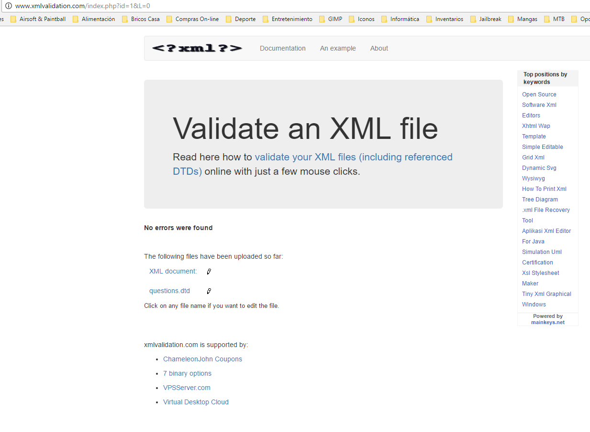
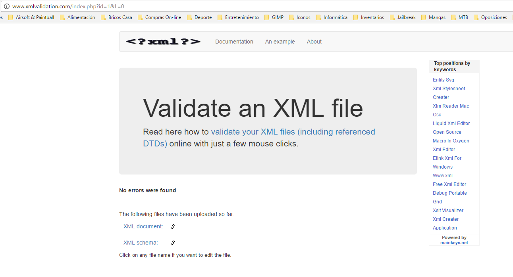

# LMSGI-04
##Validación de XML con DTD##

El tema seleccionado para el formulario es Internet y en él podemos encontrar diferentes preguntas sobre el tema (protocolos, definiciones, etc.).

El fichero se ha denominado questions.xml y contiene las preguntas, posibles respuestas y la corrección del formulario.

Se ha obtenido la información del siguiente enlace:
	* http://html.rincondelvago.com/internet_37.html

##Estructura del fichero##

El fichero sigue la siguiente estructura:

```xml
<questions>
	<question id="AMRQ_XXX">
		<type></type>
		<title></title>
		<option></option>
		<answer></answer>
	</question>
	...
</questions>
```

Aclaraciones:
	* <questions> es el elemento root.
	* <question id="AMRQ_XXX"> elemento que contiene la pregunta y todos los sub-elementos de la misma. El id es "AMRQ_XXX" donde AMR son mis iniciales y Q es de question. 
	* <option> es un elemento que no tiene por que aparecer en todas las preguntas.
	* <answer> es un elemento que aparecera mínimo una vez en cada pregunta y en algunos casos varias veces.

##Distintos Branches##

### Branch DTD###

En este branch la validación se realiza con DTD.

Documento DTD:

```dtd
<?xml version="1.0" encoding="UTF-8"?>
<!ELEMENT questions (question+)>
<!ELEMENT question (type,title,option*,answer+)>
<!ATTLIST question id ID #REQUIRED>
<!ELEMENT type (#PCDATA)>
<!ELEMENT title (#PCDATA)>
<!ELEMENT option (#PCDATA)>
<!ELEMENT answer (#PCDATA)>
```

Se ha procedido a validar el documento con http://www.xmlvalidation.com/. Tras varios errores encontrados y solucionados (no hacia uso del answer+ y no contemplaba que un elemento question tuviera más de 1 answer) se ha validado el documento.

Aquí podemos ver la validación:



###Bracnh XSD###

En este branch la validación se realiza con XSD.

Documento XSD:

```xsd
<?xml version="1.0" encoding="UTF-8"?>
<xs:schema xmlns:xs="http://www.w3.org/2001/XMLSchema">
<xs:element name="questions">
<xs:complexType>
<xs:sequence>
<xs:element name="question" maxOccurs="10" minOccurs="0">
<xs:complexType>
<xs:sequence>
<xs:element name="type">
<xs:simpleType>
<xs:restriction base="xs:string">
<xs:enumeration value="text"/>
<xs:enumeration value="radio"/>
<xs:enumeration value="multiple"/>
<xs:enumeration value="select"/>
<xs:enumeration value="checkbox"/>
</xs:restriction>
</xs:simpleType>
</xs:element>
<xs:element name="title" type="xs:string"/>
<xs:element type="xs:string" name="option" maxOccurs="unbounded" minOccurs="0"/>
<xs:element type="xs:string" name="answer" maxOccurs="unbounded" minOccurs="1"/>
</xs:sequence>
<xs:attribute name="id" type="xs:string" use="required"/>
</xs:complexType>
</xs:element>
</xs:sequence>
</xs:complexType>
</xs:element>
</xs:schema>
```
Aquí podemos ver la validación:


