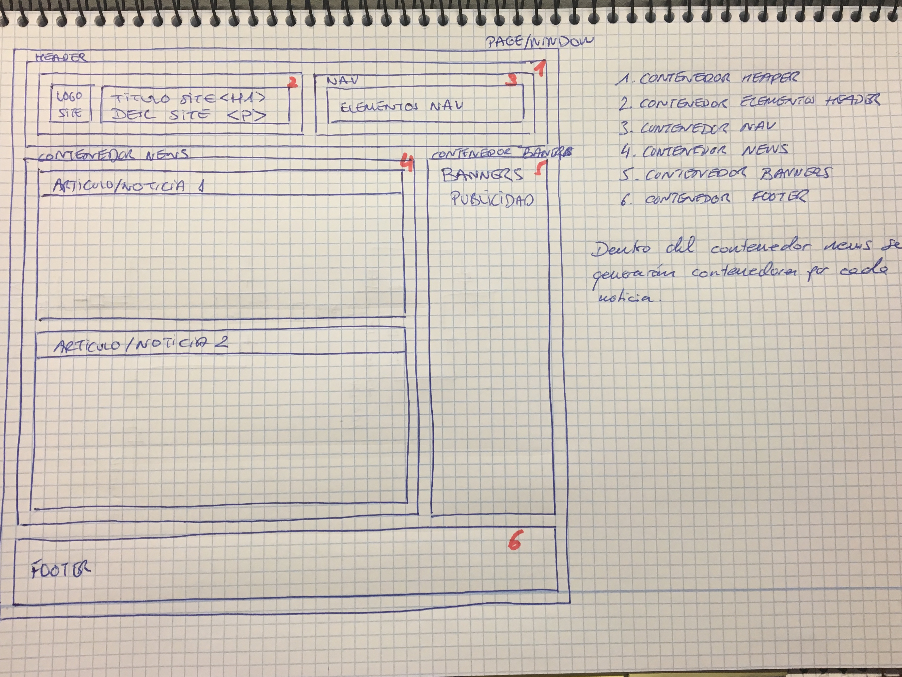
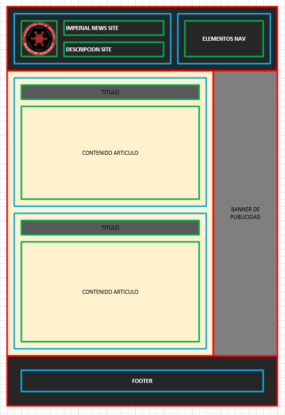

# news-lmsgi07 #

Página web de noticias auto rellenable con scroll (Bootstrap, jQuery, Json, HTML).

## Enunciado de la tarea. ##

Objectiu final: Realitzar una aplicació web de notícies que, en fer scroll fins abaix, recarregui més notícies amb html, jQuery i Bootstrap.

**Abans de començar:**

Es recomana l'ús d'un quadern per fer un disseny i el seguiment del desenvolupament de l'aplicació. Recordeu que vos examinareu per escrit.

Per disssenyar i programar primer ho feim al quadern, i quan ho tenim clar, es traduiex a l'ordinador.

_**Especificacions del client:**_

  * La maquetació (layer design) ha de deixar 300 px d'espai a la dreta de la pantalla per publicitat si la pantalla és suficientment ample. Tot altre diseny és lliure.
  * Per dispositius mòbils, la publicitat anirá fixada a la part inferior o bé només es mostrará a la part superior (i desapareixerà en fer scroll) amb un alt de 90px. Pots triar l'opció. Tot altre diseny és lliure.
  * Les dades són: títol (entorn a 8 paraules), imgbig (url al json, imatge a la carpeta), imgmid (url al json, imatge a la carpeta), descripció (mínim de 300 caràcters), data i hora (datetime).
  * Totes les notícies han de tenir el mateix format i mostrar les dades especificades de forma elegant a tot dispositiu.

_**Tasques:**_

  1. Realitza la maquetació del projecte. Entrega un breu document amb l'análisi i la planificació al README.md (valen fotos d'esquemes del quadern).
(fins a 2 punts)
  2. Presenta news.html amb 3 notícies (ja escrites al html, no carregar amb js) i emmagatzema 6 noticies més en dos fitxers, data/1.json data/2.json per ser carregades amb js.
(fins a 2 punts)
  3. Codifica news.js en jQuery per fer: "botó carregar més notícies" i "scroll bottom" que, en ser activat qualsevol d'ells, faci una càrrega i presentació de més dades (fins a dues vegades 1.json, 2.json)
(fins a 1 punt)
  4. Inclou rss.xml (especificat al tema 6)
(fins a 1 punt)
  5. Codifica news1.html i news2.html, pàgines que corresponen a les dues primeres noticies (darreres publicades). Quan feim clic a la notícia 1 de news.html ens va a news1.html, quan feim clic a la notícia 2 de news.html ens va a news2.html (seguir no té sentit, aquesta tasca s'automatitza amb codi de servidor).
(fins a 1 punt)
  6. La plantilla o pàgina de veure una sola notícia news1.html (news2.html és idèntica) ha de contenir una imatge i un vídeo de youtube responsive (veure: http://fpadistancia.caib.es/mod/page/view.php?id=64319 ) 
(fins a 1 punt)
  7. Cada pàgina ha de contenir les etiquetes meta (amb open graph) per compartir títol, descripció, imatge (gran), nom de l'aplicació i url de la pàgina. 
(fins a 1 punt)
  8. Fins a + 2 punts: acabat final (o dit d'un altra forma: complir les especificacions del client o donar solucions elegants alternatives)
  
## Implementación ##

### Idea inicial ###
Se realiza un primer esquema de la idea sobre el papel.

### Diseño escritorio ###
Se idea el esquema con varios contenedores el diseño de escritorio.

Despues de este diseño se deriva a la siguiente estructura en el diseño del layout.

Los contenedores son:

 1. Contenedor Header.
 2. Contenedor para los elementos del header:
   * Contenedor del título y logo.
   * Contenedor NAV.
 3. Contenedor Contenido:
   * Contenedor Publicaciones / NEWS.
     * Contenedores para cada articulo/noticia.
   * Contenedor Banners publicidad.
 4. Contenedor Footer.
 
Por lo que el Contenedor 1 ocupara todo el ancho de la pantalla. Dentro tendra 2 subcontenedores el cual los porcentajes seran un 70% (logo y título) y 30% el contenedor de navegación.

Contenedor de Contenido se dividirá en 2 columnas. La principal (publicaciones) ocupara el total de la pantalla menos 300 px que seran dedicados al contenedor del banner (en el dispositivo móvil esto cambiará).

Finalmente tenemos el último contenedor que sera el footer. Ocupará toda la pantalla.

### Validación de los ficheros con:###
	* https://validator.w3.org/nu
	* http://codebeautify.org/jsonvalidator
	* https://validator.w3.org/feed/
	* https://jigsaw.w3.org/css-validator/

### Otros ###

Las noticias han sido obtenidas de los siguientes enlaces:

  * https://www.vidaextra.com/fps/todo-lo-que-necesitas-saber-sobre-star-wars-battlefront-2
  * http://prensaimperial.com/2017/05/spoiler-revelan-nombre-tendrian-los-caballos-espaciales-del-episodio-viii/
  * http://prensaimperial.com/2017/04/ea-escucho-fuerte-claro-la-comunidad-star-wars-battlefront-nuevos-detalles-del-juego/
  * http://www.hobbyconsolas.com/noticias/star-wars-8-ultimos-jedi-collar-luke-esconde-secreto-rumor-96556
  * https://www.xataka.com/ciencia-ficcion/una-star-wars-muy-real-cuando-la-fuerza-te-acompana-hasta-construir-cazas-o-pensar-en-la-fisica-del-sable-laser
  * http://cultura.elpais.com/cultura/2017/05/03/actualidad/1493818669_416939.html
  * http://www.vandal.net/noticia/1350690933/star-wars-battlefront-ii-ofreceria-compatibilidad-con-playstation-vr-en-ps4/
  * http://www.lacapital.com.ar/escenario/un-nuevo-comienzo-star-wars-pero-la-princesa-leia-n1392567.html
  * http://www.culturaocio.com/cine/noticia-director-ultimos-jedi-pidio-cambiar-final-despertar-fuerza-20170505120105.html
  * http://computerhoy.com/noticias/zona-gaming/star-wars-battlefront-2-tendra-modo-campana-todos-detalles-57876
  * 